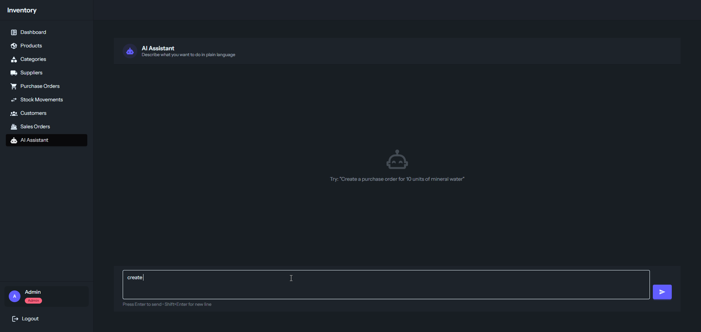

# Inventory

A full-stack inventory management system built with Laravel, Vue.js 3, and Inertia.js.

## Features

- **Products, Categories, Suppliers** — CRUD with search, sort, pagination, and bulk delete
- **Customers** — Customer management (create, edit, delete)
- **Stock Movements** — Stock in / out with transactional safety and locking
- **Purchase Orders** — Full lifecycle: Draft → Approved → Dispatched → Received → Closed (or Cancelled), with partial receipts
- **Sales Orders** — Full lifecycle: Draft → Confirmed → Fulfilled (or Cancelled), with stock deduction on fulfillment
- **Dashboard** — KPIs, low-stock alerts, recent movements, recent orders
- **Auth & Roles** — Login + role-based authorization (Admin, Manager, Staff)
- **AI Assistant** — Natural-language inventory commands powered by Google Gemini; parse intent, confirm, then execute

## AI Assistant



Type plain-language commands and the AI will interpret them, show a confirmation card with resolved product names, and execute on approval. Supports:

| Command               | Example                                                |
| --------------------- | ------------------------------------------------------ |
| Create purchase order | "Order 10 mineral water and 5 staples from supplier X" |
| Create sales order    | "Sell 3 sticky notes and 2 pens to customer Y"         |
| Add product           | "Add new product: Hotdog 300g, price 2.50, cost 1.50"  |
| Edit product          | "Update price of mineral water to 1.80"                |
| Check stock           | "How many staples do we have?"                         |

> **Requires** `GEMINI_API_KEY`, `AI_PROVIDER`, and `AI_MODEL` in `.env`.

## Tech Stack

- **Backend:** PHP 8.3, Laravel 13, Inertia Laravel v3, Wayfinder
- **Frontend:** Vue 3, Inertia Vue v3, TypeScript, Tailwind CSS v4, daisyUI v5, Vite
- **AI:** Laravel AI SDK v0, Google Gemini
- **Tooling:** Pint, ESLint, Prettier, vue-tsc, Pest / PHPUnit

## Setup

```bash
# Install dependencies
composer install
pnpm install

# Configure environment
cp .env.example .env
php artisan key:generate

# Database
php artisan migrate --seed
```

Add the following to `.env` to enable the AI Assistant:

```env
GEMINI_API_KEY=your-key-here
AI_PROVIDER=gemini
AI_MODEL=gemini-2.0-flash
```

### Demo Users

| Email               | Password | Role    |
| ------------------- | -------- | ------- |
| admin@example.com   | password | Admin   |
| manager@example.com | password | Manager |
| staff@example.com   | password | Staff   |

## Development

```bash
# Run server, queue, and Vite together
composer dev

# Or individually
php artisan serve
pnpm dev
```

## Build

```bash
pnpm build         # production assets
pnpm build:ssr     # with SSR
```

## Project Structure

```
app/
  Ai/Agents/          # InventoryCommandAgent (Gemini structured output)
  Http/Controllers/   # Resource + auth + AI assistant controllers
  Models/             # Eloquent models
  Services/           # AiAssistantService, PurchaseOrderService, StockMovementService
  Policies/           # Role-based authorization
  Enums/              # Position, PurchaseOrderStatus, SalesOrderStatus
  Filters/            # Query filters (product, category, supplier, customer, orders)
resources/js/
  pages/              # Inertia pages (Dashboard, Product, Category, Supplier, Customer,
  |                   #   PurchaseOrders, SalesOrders, StockMovements, AiAssistant)
  components/         # Shared Vue components
  layouts/            # AppLayout
routes/web.php        # All routes
doc/                  # Screenshots and demo GIFs
```

## Architecture Decisions

- **Denormalized `current_stock`** — Stored directly on the product for fast reads, updated via transactions on every stock movement
- **PO / SO cancellation over deletion** — Orders are cancelled not deleted to preserve audit trail integrity
- **Context-aware order view** — Show page renders inline editing for draft/approved states, read-only for completed states
- **lockForUpdate on stock writes** — Prevents race conditions when concurrent requests modify the same product stock
- **AI two-step flow** — Prompt endpoint only parses intent; confirm endpoint executes — no accidental mutations
